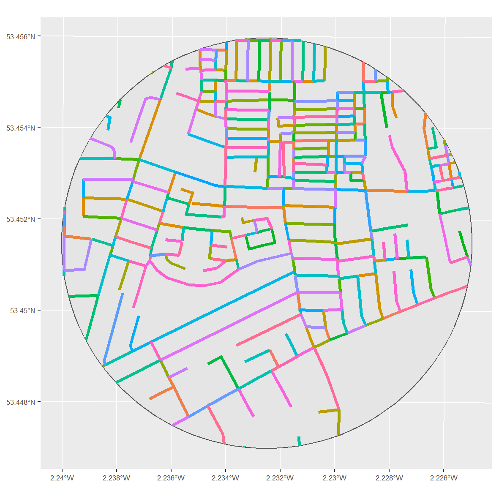

```{r setup, include=FALSE}
knitr::opts_chunk$set(echo = FALSE)
```

In recent years, a consensus has begun to emerge over the suitability of street segments for visualising and analysing the geographic patterning of crime. A number of studies have demonstrated that these so-called 'micro' places are not only theoretically meaningful behavioural spaces, but that most 'action' (e.g. concentration and variation in crime) occurs among street segments, making them particularly useful units of analysis for studying criminal behaviour and designing crime-reducing interventions.

But how useful is the 'street segment' outside of North America? To what extent are these micro units comparable between cities, and between countries? So far, I haven't found much data-driven research into the uniformity and 'universality' of street segments in terms of their physical characteristics. But, I think there is enough evidence out there to justify further scrutiny. In Sweden, for instance, street segments have been described as "virtually useless" because many urban areas are designed to be car-free, and therefore have little or no actual streets.

Unfortunately for us, the UK does not have the foresight to have many car-free urban areas. However, it does contain cities with highly variable histories of urban development. It seems / seemed implausible to me that the physical characteristics of street segments in, say, Milton Keynes, a purpose-built town which did not exist until the 1960s, were comparable to those in Edinburgh, which gained city status around 400 years ago.

To satisfy my own curiosity, and to gauge people's interest / enthusiasm for the topic, I have spent a bit of time exploring the physical characteristics (length and sinuosity) of street segments in the UK. All the code used to generate the (very preliminary) findings presented here is openly available. If anyone has any thoughts or pointers, please do get in touch.

## Street segments

Street segments are defined as “the two block faces on both sides of the street between two intersections”. While the definition is clearly geared towards the grid-based street networks of North America, we can apply a comparable concept to the UK using data from Ordnance Survey Open Roads. Here, individual roads are defined (and given a unique ID) according to the meeting of intersections. As an example, the following visual plots street segments within a 500-metre buffer in the centre of Manchester. Each road ID has been coloured to help demonstrate the individual street segments.

```{r manc, fig.pos = 'H', message=F, comment=F, warning=F, fig.cap = "Street segments in the centre of Manchester"}

```

To me, the Ordnance Survey data fits the definition of street segments rather well. Each line (i.e. individual ID) represents both sides of the street, and each line is segmented based on its intersection with another road.

To get things started, I collated this data for eight major towns and cities in the UK. Roads were clipped according to the town or city boundary, and those roads classified as motorways (highways) were removed. As evidenced below, the town/city boundaries sometimes include satellite towns and hamlets. This raises a related discussion about the universality of street segments in terms of urban/rural areas and how city boundaries are defined -- I might return to this another time.

```{r regions, fig.pos = 'H', message=F, comment=F, warning=F, fig.cap = "Study regions"}
knitr::include_graphics("visuals/study_regions_lq.png")
```

For now, I focus on describing the physical characteristics of these street segments in two ways: **length** and **sinuosity**. By examining the degree to which street segments are homogeneous in length and sinuosity, both within and between study regions, we might shed some light on the degree to which they can be considered a 'universal' unit of analysis.

**Length** is not as self-explanatory as we might first think (e.g. topological length), but here we are talking about it in the conventional sense (i.e. metric length). Although there is not much information out there, there appears to be at least _some_ variation in the length of street segments used in crime concentration research. It is often added as a control variable in analysis.

Should street segments represent universally meaningful behavioural spaces, might we expect a fairly narrow range and minimal variation in street segment length, even across different study regions?

**Sinuosity** is a fairly new concept to me. In crude terms, and at the risk of annoying geographers and mathematicians, sinuosity in this context represents a measure of 'curviness'. It is calculated by dividing the actual length of a line by the straight line distance (i.e. the distance between the start and end point). So, a perfectly straight street segment, for which the actual length and straight line length are the same, will have a sinuosity of 1, the smallest value possible. The example below, using street segments randomly sampled from Birmingham, demonstrates this concept.

```{r simexample, fig.pos = 'H', message=F, comment=F, warning=F}
knitr::include_graphics("visuals/sin_example.png")
```

Again, the reasoning behind examining sinuosity is to scrutinise the universality of street segments as a meaningful behavioural spaces to study crime. A huge amount of variation in the sinuosity of street segments (either within the same study region, or between different study regions) might give reason to question this. Modern, grid-based cities might be almost entirely comprised of street segments with a sinuosity of 1. Cities with a long and convoluted history of urban development might have no discernible pattern, and little uniformity.

## Characteristics

```{r length, fig.pos = 'H', message=F, comment=F, warning=F}
knitr::include_graphics("visuals/length.png")
```

```{r stats, fig.pos = 'H', message=F, comment=F, warning=F, fig.cap = "Characteristics of street segments by city."}
stats_df <- readr::read_csv("results/cities_roads_stats.csv")

kableExtra::kable(stats_df, format = "pipe")
```

```{r lengthno, fig.pos = 'H', message=F, comment=F, warning=F}
knitr::include_graphics("visuals/length_no.png")
```

## Conclusion

