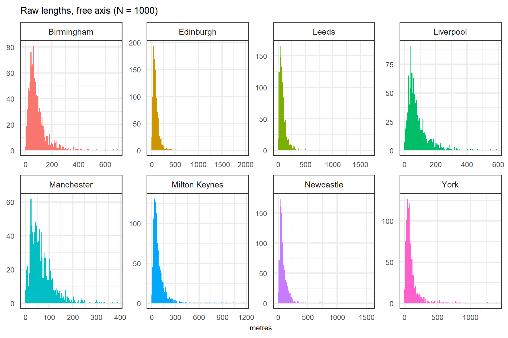
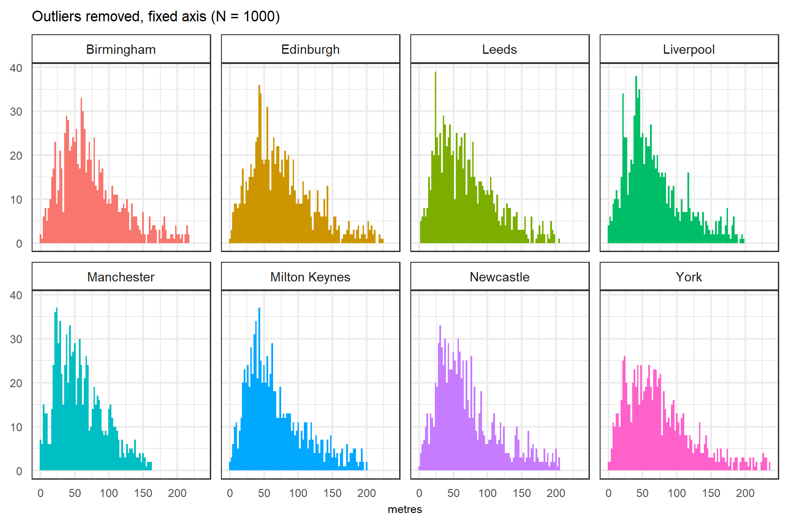

```{r setup, include=FALSE}
knitr::opts_chunk$set(echo = FALSE)
```

Unit of analysis is important. Debate over suitability of meso / micro. A consensus has been built around 'street segments' as the most appropriate micro-scale to study crime. But little attention has been paid to the physical characteristics of street segments, especially between study regions / countries. Here, we look at a selection of major cities in the UK to look at the characteristics of street segments: length and sinuosity. 

## Street segments

```{r regions, fig.pos = 'H', message=F, comment=F, warning=F, fig.cap = "Study regions"}
knitr::include_graphics("visuals/study_regions_lq.png")
```

## Characteristics

```{r simexample, fig.pos = 'H', message=F, comment=F, warning=F}
knitr::include_graphics("visuals/sin_example.png")
```

```{r length, fig.pos = 'H', message=F, comment=F, warning=F}

```

```{r stats, fig.pos = 'H', message=F, comment=F, warning=F, fig.cap = "Characteristics of street segments by city."}
stats_df <- readr::read_csv("results/cities_roads_stats.csv")

kableExtra::kable(stats_df, format = "pipe")
```

```{r lengthno, fig.pos = 'H', message=F, comment=F, warning=F}

```

## Conclusion

